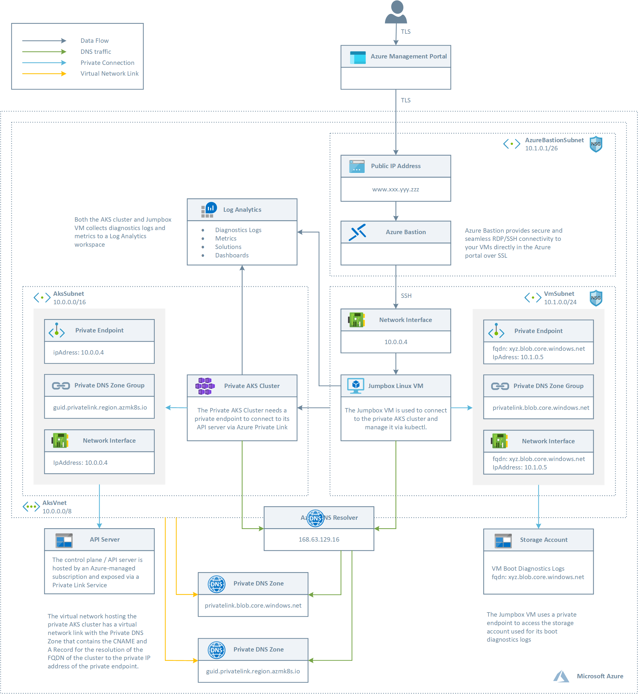

# Create a Private AKS Cluster #

This ARM template includes all the latest features like [private AKS clusters](https://docs.microsoft.com/en-us/azure/aks/private-clusters), new simplified [AKS-managed AAD integration](https://docs.microsoft.com/en-us/azure/aks/managed-aad), the brand new [Azure RBAC for Kubernetes Authorization](https://docs.microsoft.com/en-us/azure/aks/manage-azure-rbac), actually in preview, and the use of [managed identity in place of a service principal](https://docs.microsoft.com/en-us/azure/aks/use-managed-identity), and more. 

The API server endpoint has no public IP address. To manage the API server, you will need to use a VM that has access to the AKS cluster's Azure Virtual Network (VNet). Therefore, the ARM template deploys a Jumpbox in the same virtual network that hosts the AKS private cluster. There are several options for establishing network connectivity to the private cluster.

- Create a VM in the same Azure Virtual Network (VNet) as the AKS cluster.
- Use a VM in a separate network and set up Virtual network peering. See the section below for more information on this option.
- Use an Express Route or VPN connection.

Creating a VM in the same VNET as the AKS cluster is the easiest option. Express Route and VPNs add costs and require additional networking complexity. Virtual network peering requires you to plan your network CIDR ranges to ensure there are no overlapping ranges. For more information, see [Create a private Azure Kubernetes Service cluster](https://docs.microsoft.com/en-us/azure/aks/private-clusters). For more information on Azure Private Links, see [What is Azure Private Link?](https://docs.microsoft.com/en-us/azure/private-link/private-link-overview).

## Architecture ##

The following picture shows the architecture and network topology of the sample.

The ARM template deploys:

- A new virtual network with two subnets, one for the AKS cluster and one for a Jumpbox VM
- An AKS cluster with a private endpoint to the control plane / API server hosted by an AKS-managed Azure subscription. The cluster can communicate with the API server exposed via a Private Link Service using a private endpoint. The deployment of an AKS private cluster also creates:

  - A Private Endpoint in the same subnet of the AKS cluster.
  - A Network Interface associated to the private endpoint.
  - A Private DNS Zone for the name resolution of the private endpoint.
  - Two A records in the Private DNS Zone to let the cluster resolve the FQDN of the AKS cluster to the private IP address of its control plane.
  - A Virtual Network Link between the virtual network hosting the cluster and the Private DNS Zone to let the cluster to use the CNAME and A records defined by the Private DNS Zone for the name resolution of the API server of the cluster.
- A Jumpbox VM
- Log Analytics to collect the diagnostics logs and metrics of both the AKS cluster and Jumpbox VM

## Deployment ##

The following picture shows the resources deployed by the ARM template in the target resource group.

The following picture shows the resources deployed by the ARM template in the MC resource group associated to the AKS cluster:

## Testing ##

If you open an ssh session to the Linux virtual machine and manually run the nslookup command using the FQND of the API server as a parameter, you should see an output like the the following:

