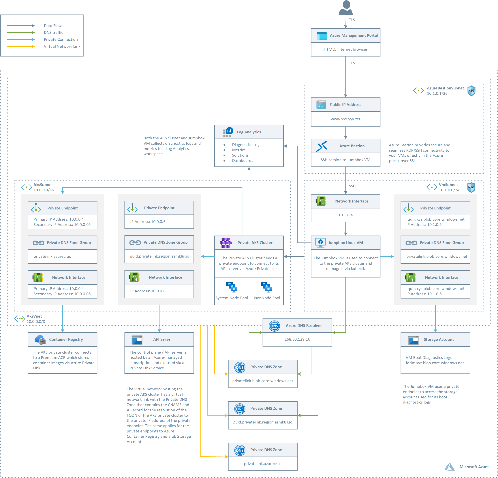
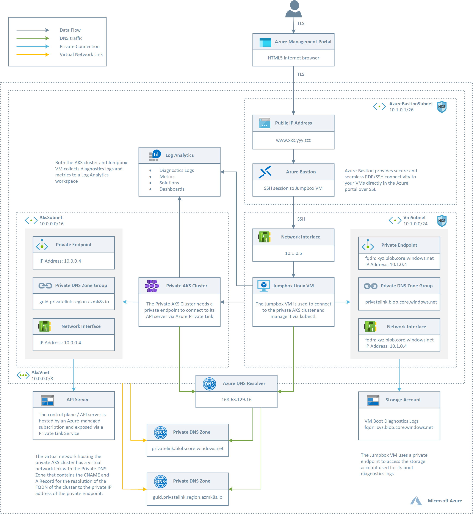

# Create a private Azure Kubernetes Service cluster #

This ARM template includes all the latest features like [private AKS clusters](https://docs.microsoft.com/en-us/azure/aks/private-clusters), new simplified [AKS-managed AAD integration](https://docs.microsoft.com/en-us/azure/aks/managed-aad), the brand new [Azure RBAC for Kubernetes Authorization](https://docs.microsoft.com/en-us/azure/aks/manage-azure-rbac), actually in preview, and the use of [managed identity in place of a service principal](https://docs.microsoft.com/en-us/azure/aks/use-managed-identity), and more. 

The API server endpoint has no public IP address. To manage the API server, you will need to use a virtual machine that has access to the AKS cluster's Azure Virtual Network (VNet). Therefore, the ARM template deploys a Jumpbox in the same virtual network that hosts the private AKS cluster. There are several options for establishing network connectivity to the private cluster.

- Create a virtual machine in the same Azure Virtual Network (VNet) as the AKS cluster.
- Use a virtual machine in a separate network and set up Virtual network peering. See the section below for more information on this option.
- Use an Express Route or VPN connection.

Creating a virtual machine in the same virtual network as the AKS cluster is the easiest option. Express Route and VPNs add costs and require additional networking complexity. Virtual network peering requires you to plan your network CIDR ranges to ensure there are no overlapping ranges. For more information, see [Create a private Azure Kubernetes Service cluster](https://docs.microsoft.com/en-us/azure/aks/private-clusters). For more information on Azure Private Links, see [What is Azure Private Link?](https://docs.microsoft.com/en-us/azure/private-link/private-link-overview).

## Architecture ##

This sample provides two distinct ARM templates to deploy two different topologies with one or two node pools.

### Two Node Pools ###



The ARM template deploys:

- A new virtual network with three subnets, one for the AKS cluster, one for Azure Bastion and one for a Jumpbox virtual machine used to connect to the private AKS cluster.
- The private AKS cluster uses a user-defined managed identity to create additional resources like load balancers and managed disks in Azure.
- The private AKS cluster is composed of a:
  - System node pool hosting only critical system pods and services. The worker nodes have node taint which prevents application pods from beings scheduled on this node pool.
  - User node pool hosting user workloads and artifacts.
- An AKS cluster with a private endpoint to the control plane / API server hosted by an AKS-managed Azure subscription. The cluster can communicate with the API server exposed via a Private Link Service using a private endpoint.
- An Azure Bastion resource that provides secure and seamless SSH connectivity to the Jumpbox virtual machine directly in the Azure portal over SSL
- An Azure Container Registry (ACR) to build, store, and manage container images and artifacts in a private registry for all types of container deployments.
- When the ACR sku is equal to Premium, a Private Endpoint is created to allow the private AKS cluster to access ACR via a private IP address. For more information, see [Connect privately to an Azure container registry using Azure Private Link](https://docs.microsoft.com/en-us/azure/container-registry/container-registry-private-link).
- A Private Endpoint in the same subnet of the AKS cluster.
- A Network Interface associated to the private endpoint.
- A Private DNS Zone for the name resolution of the private endpoint.
- Two A records in the Private DNS Zone to let the cluster resolve the FQDN of the AKS cluster to the private IP address of its control plane.
- A Virtual Network Link between the virtual network hosting the cluster and the Private DNS Zone to let the cluster to use the CNAME and A records defined by the Private DNS Zone for the name resolution of the API server of the cluster.
- A jumpbox virtual machine to manage the private AKS cluster.
- A private endpoint to the storage account hosting the boot diagnostics logs of the jumpbox virtual machine.
- A Log Analytics workspace to collect the diagnostics logs and metrics of both the AKS cluster and Jumpbox virtual machine.

### One Node Pool ###



The ARM template deploys:

- A new virtual network with three subnets, one for the AKS cluster, one for Azure Bastion and one for a Jumpbox virtual machine used to connect to the private AKS cluster.
- The private AKS cluster uses a system-assigned managed identity to create additional resources like load balancers and managed disks in Azure.
- The private AKS cluster has a single system node pool hosting both critical system pods and user pods.
- An AKS cluster with a private endpoint to the control plane / API server hosted by an AKS-managed Azure subscription. The cluster can communicate with the API server exposed via a Private Link Service using a private endpoint.
- An Azure Bastion resource that provides secure and seamless SSH connectivity to the Jumpbox virtual machine directly in the Azure portal over SSL
- A Private Endpoint in the same subnet of the AKS cluster.
- A Network Interface associated to the private endpoint.
- A Private DNS Zone for the name resolution of the private endpoint.
- Two A records in the Private DNS Zone to let the cluster resolve the FQDN of the AKS cluster to the private IP address of its control plane.
- A Virtual Network Link between the virtual network hosting the cluster and the Private DNS Zone to let the cluster to use the CNAME and A records defined by the Private DNS Zone for the name resolution of the API server of the cluster.
- A jumpbox virtual machine to manage the private AKS cluster.
- A private endpoint to the storage account hosting the boot diagnostics logs of the jumpbox virtual machine.
- A Log Analytics workspace to collect the diagnostics logs and metrics of both the AKS cluster and Jumpbox virtual machine.

## Deployment ##

You can use the **deploy-two-node-pools.sh** Bash script to deploy the topology with two node pools and ACR, while you can use the **deploy-one-node-pool.sh** Bash script to deploy the topology with one node pool and no ACR. The following picture shows the resources deployed by the ARM template in the target resource group.


The following picture shows the resources deployed by the ARM template in the MC resource group associated to the AKS cluster:


## Visio ##

In the **visio** folder you can find the Visio document which contains the above diagrams.

## Testing ##

If you open an ssh session to the Linux virtual machine and manually run the nslookup command using the FQND of the API server as a parameter, you should see an output like the the following:


In order to connect the AKS cluster, you can run th following Bash script on the Jumpbox virtual machine:

```bash
#!/bin/bash
name="<name of the AKS cluster>"
resourceGroup="<name of the AKS resource group>"

# Install Azure CLI on Ubuntu
curl -sL https://aka.ms/InstallAzureCLIDeb | sudo bash

# Login with your Azure account
az login

# Install Kubectl
sudo az aks install-cli

# Use the following command to configure kubectl to connect to the new Kubernetes cluster
echo "Getting access credentials configure kubectl to connect to the ["$aksName"] AKS cluster..."
az aks get-credentials --name $name --resource-group $resourceGroup
```
